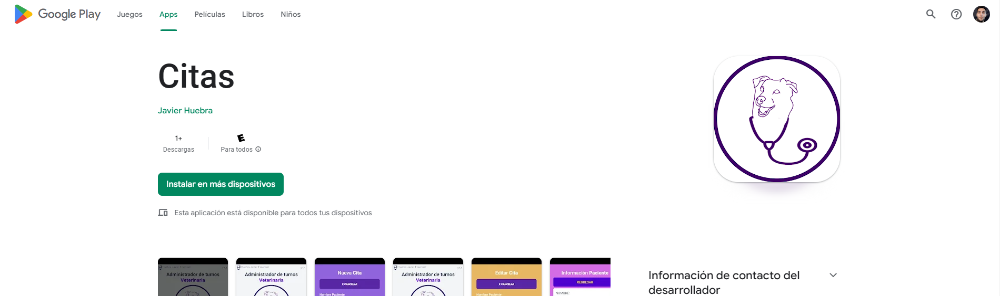

# App_Turnos_ReactNative_Android
## An application without a backend for the moment, it consists of a system to manage shifts for a veterinarian

## If you want to try the app, although it is quite reduced in functionality since the purpose was to be able to place my creation in the playstore, you can use the following link:
 
<a href="https://play.google.com/store/apps/details?id=com.citas.nuevocoso">Link to play store</a>

